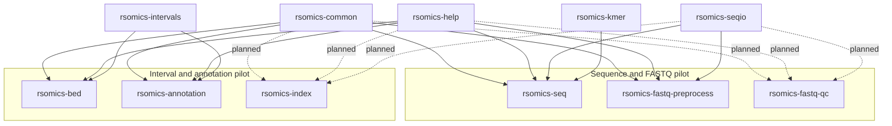

# Product reconstruction dossiers

This directory is the product-level map between the retained historical source
pool and the public rsomics portfolio.

A dossier is an implementation contract, not a promise that every historical
operation will ship. It records:

- upstream scope and user-recognizable operations;
- overlapping implementations and the selected canonical operation;
- historical code, test, fixture, and benchmark assets;
- target subcommands and internal modules;
- public-foundation consumers;
- compatibility and performance gates;
- explicit exclusions and staged release slices.

## Portfolio map

| Product | Source candidates | Dossier state |
|---|---:|---|
| `rsomics-annotation` | 2 | [audited](interval-annotation-index.md#rsomics-annotation) |
| `rsomics-bam` | 39 | queued after the low-state pilots |
| `rsomics-bed` | 42 | [audited](interval-annotation-index.md#rsomics-bed) |
| `rsomics-composition` | 10 | [audited](composition.md) |
| `rsomics-count` | 1 | [audited](count.md) |
| `rsomics-deseq` | 12 | queued |
| `rsomics-ecology` | 19 | [audited](ecology.md) |
| `rsomics-edger` | 17 | queued |
| `rsomics-expression` | 2 | boundary review required with DE products |
| `rsomics-fastq-preprocess` | 12 | [audited](sequence-fastq.md#rsomics-fastq-preprocess) |
| `rsomics-fastq-qc` | 1 | [audited](sequence-fastq.md#rsomics-fastq-qc) |
| `rsomics-index` | 4 | [audited](interval-annotation-index.md#rsomics-index) |
| `rsomics-liftover` | 1 | [audited](liftover.md) |
| `rsomics-limma` | 16 | queued |
| `rsomics-metagenomics` | 5 | [audited](metagenomics-sketch.md#rsomics-metagenomics) |
| `rsomics-methyl` | 1 | [audited](methyl.md) |
| `rsomics-minimap2` | 1 | [audited](minimap2.md); legacy release requires reconstruction |
| `rsomics-peak` | 5 | [audited](peak.md); four workflow assets and one discarded generic candidate |
| `rsomics-phylo` | 11 | [audited](phylo.md) |
| `rsomics-plink` | 28 | queued |
| `rsomics-popgen` | 16 | queued |
| `rsomics-rnaseq-qc` | 26 | queued |
| `rsomics-sc` | 29 | queued |
| `rsomics-seq` | 34 | [audited](sequence-fastq.md#rsomics-seq) |
| `rsomics-signal` | 15 | queued |
| `rsomics-sketch` | 1 | [audited](metagenomics-sketch.md#rsomics-sketch) |
| `rsomics-structure` | 9 | queued |
| `rsomics-table` | 16 | [audited](table.md) |
| `rsomics-vcf` | 48 | queued after the low-state pilots |

Counts are generated from
[`portfolio-inventory.tsv`](../00-overview/portfolio-inventory.tsv). They
describe recoverable inputs, not planned subcommand counts.

## Rejected public boundary

| Former candidate | Source candidates | Decision |
|---|---:|---|
| `rsomics-workflow` | 1 | [rejected](workflow.md); the sample-sheet asset is consumer-specific metadata validation, not a workflow product |

## Relationship map

Solid arrows are current consumer contracts. Dotted arrows are planned
consumers and do not justify a public API by themselves. None implies that a
foundation API is already stable.
