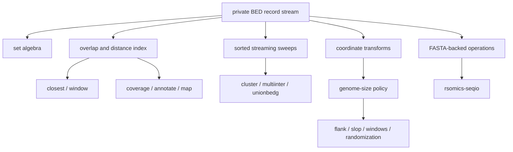

# BED product dossier

Status: `rsomics-bed 0.1.0` is published with `sort`, `merge`, `intersect`,
`subtract`, and `complement`. Release candidate 0.2.0 at
`02b85a1a348c271e485cca629dc4e71fa075388a` adds `cluster`, `window`, and
`closest` and passed exact-head four-platform CI run `32329089591`. The
representative performance source is
`d7b1507b178053a087862255d84a244e4921f192`. Registry publication is blocked
only by the expired organization credential: publish run `32329397022`
completed package verification and then received crates.io `403 authentication
failed`. The registry therefore still serves 0.1.0.

## Boundary

`rsomics-bed` is one BED and BEDPE interval-workflow product. It owns strict
BED parsing, optional-field interpretation, genome-file ordering, interval set
algebra, neighborhood queries, coverage summaries, interval generation, and
interval-driven reference-sequence operations. A user installs one binary and
selects operations with subcommands; an upstream executable name or flag does
not create another crate.

The primary behavior sources are:

- [UCSC BED](https://genome.ucsc.edu/FAQ/FAQformat.html#format1) for BED3–BED12,
  zero-based half-open coordinates, optional-field ordering, BED12 blocks, and
  zero-length insertion features;
- [BEDTools 2.31.1](https://bedtools.readthedocs.io/en/latest/content/bedtools-suite.html)
  for the familiar operation contracts and byte-level compatibility oracle;
- [BEDOPS 2.4.41](https://bedops.readthedocs.io/en/latest/content/overview.html)
  for multi-input set algebra, closest-feature, mapping, sorted streaming, and
  representative low-memory alternatives.

BEDTools remains the primary oracle because the historical rsomics assets were
built against it. BEDOPS is a second behavioral and performance reference, not
a source-code dependency. GPL-covered BEDOPS source is not copied.

## Product relationship map

The record stream, indexes, overlap filters, and reducers remain private until
another Layer B product demonstrates the same policy-free API. No Layer B
product depends on `rsomics-bed`.

## Operation map

Target commands use readable product vocabulary. Familiar BEDTools short flags
may be migration aliases, but the typed long-form contract owns the help.

| Target operation | Real upstream behavior | State and decision |
|---|---|---|
| `validate` | UCSC BED3–BED12 and BEDTools parser failures | later structural slice; strict optional-field and block checks |
| `inspect` | BEDTools `summary`; historical count/stats/total-bp | later; one report replaces four count-only commands |
| `sort` | BEDTools `sort`; BEDOPS `sort-bed` | published; stable coordinate ties are an explicit rsomics guarantee |
| `merge` | BEDTools `merge`; BEDOPS `--merge` | published |
| `intersect` | BEDTools `intersect`; BEDOPS intersect/element-of | published clipped-output slice; later report modes stay options here |
| `subtract` | BEDTools `subtract`; BEDOPS `--difference` | published |
| `complement` | BEDTools `complement`; bounded BEDOPS complement | published with an explicit genome file |
| `cluster` | BEDTools `cluster` | implemented on main; sorted streaming, distance, and strand policy |
| `window` | BEDTools `window` | implemented on main; symmetric/asymmetric, strand-relative, and report modes |
| `closest` | BEDTools `closest`; BEDOPS `closest-features` | implemented on main; complete declared single-B contract before multi-B extensions |
| `coverage` | BEDTools `coverage` | later coverage slice; BED input only, with count, breadth, histogram, and depth modes |
| `annotate` | BEDTools `annotate` | later coverage slice; multi-file count/fraction output |
| `map` | BEDTools `map`; BEDOPS `bedmap` | later coverage slice; one private reducer shared with `annotate` |
| `jaccard` | BEDTools `jaccard` | later metrics slice; base-pair set similarity and overlap filters |
| `fisher` | BEDTools `fisher` | later metrics slice; requires a genome-size universe |
| `reldist` | BEDTools `reldist` | later metrics slice; fixed historical midpoint-straddle behavior is retained |
| `multiinter` | BEDTools `multiinter`; BEDOPS partition | later multi-file sweep slice |
| `genomecov` | BEDTools `genomecov` | later track slice for BED input; BAM input belongs to `rsomics-bam` |
| `unionbedg` | BEDTools `unionbedg` | later track slice |
| `flank` | BEDTools `flank` | later coordinate-generation slice |
| `slop` | BEDTools `slop`; BEDOPS range padding | later coordinate-generation slice |
| `shift` | BEDTools `shift` | later coordinate-generation slice |
| `makewindows` | BEDTools `makewindows`; BEDOPS chop/stagger | later coordinate-generation slice |
| `random` | BEDTools `random` | later seeded-generation slice |
| `shuffle` | BEDTools `shuffle` | later seeded-generation slice |
| `sample` | BEDTools `sample` | later deterministic sampling slice |
| `getfasta` | BEDTools `getfasta` | later reference slice using `rsomics-seqio` random access |
| `maskfasta` | BEDTools `maskfasta` | later reference slice; one implementation replaces two historical clones |
| `nuc` | BEDTools `nuc` | later reference slice |
| `overlap` | BEDTools `overlap` | later BEDPE/shape slice |
| `pair-to-bed` | BEDTools `pairtobed` | deferred until the BEDPE record contract is complete |
| `pair-to-pair` | BEDTools `pairtopair` | deferred with `pair-to-bed` |
| `convert` | BEDTools `bed12tobed6`; historical BED-to-GFF | later format slice with explicit `bed6` and `gff3` targets |
| `split` | BEDTools source-level `split` utility | later multi-output slice; not confused with BED12 block splitting |
| `spacing` | BEDTools source-level `spacing` utility | deferred until its under-documented contract is recovered from the pinned executable and source |

BEDOPS symmetric difference and partition remain possible modes of the set
algebra above. They do not justify duplicate commands until a workflow needs
the semantic gap that `intersect`, `subtract`, `merge`, and `makewindows` do not
cover.

## Operations routed elsewhere

| Upstream operation | Target | Reason |
|---|---|---|
| BEDTools `expand`, `groupby` | `rsomics-table` | table-column expansion and aggregation, not interval algebra |
| `bamtobed`, `bamtofastq`, `bedtobam`, `bedpetobam` | `rsomics-bam` | alignment-format conversion and validation own the workflow |
| BEDTools `multicov`, BAM mode of `genomecov`, `tag` | `rsomics-bam` | indexed alignment coverage and tagging require BAM policy and `rsomics-bamio` |
| BEDOPS Starch and indexed extraction | `rsomics-index` candidate | compression and persistent indexing are separate installation workflows |
| BEDTools `igv`, `links` | excluded | GUI snapshot scripting and HTML browser links are not data operations |
| GFF/GTF or VCF inputs accepted by BEDTools | `rsomics-annotation` or `rsomics-vcf` | each product owns its format semantics and converts at a checked interval boundary |

The historical `count`, `len`, `midpoint`, `stats`, `total-bp`, and `unique`
executables do not survive as public crates. Count and length summaries fold
into `inspect`; coordinate deduplication becomes a `sort` option. Appending a
length and collapsing to a midpoint remain deferred conveniences rather than
commands invented solely to preserve old code.

## Historical asset dispositions

The classification is about implementation reuse, not repository revival.
Every old command shell and duplicated `rsomics-help` specification is
discarded.

| Assets and recorded revisions | Classification | Retained value |
|---|---|---|
| `bed-sort` `5dce75d5a7e`, `bed-merge` `c9e39b3e760e`, `bed-intersect` `e7dc1e7e462e`, `bed-subtract` `927c257de23b`, `bed-complement` `94ea9f552620` | 2, completed | algorithms and strongest goldens were refactored into 0.1.0 |
| `bed-closest` `e85ed1339165` | 2, completed | retained corrected distance, zero-length, no-hit, and tie cases; replaced the permissive parser and full B scan |
| `bed-cluster` `b63b75567ba7` | 2, completed | retained the sorted sweep and oracle cases; moved behavior onto the product parser and output layer |
| `bed-window` `875459ee2f79` | 3, completed | retained fixtures and benchmark recipe; rewrote indexing, parsing, output modes, and CLI |
| `bed-coverage` `269e1f6ca740`, `bed-annotate` `551632db1dce`, `bed-map` `1fb4c6cc8d84` | 2/3 | retain coverage math and goldens; replace three readers and converge on one candidate/reducer core |
| `bed-jaccard` `ca81d15e39d0` | 2 | retain merged-set sweep, numeric formatting tests, and fixtures; add checked filters and product I/O |
| `bed-fisher` `fc7bb057f3d2` (dirty), `bed-reldist` `36cdfdead5f6`, `bed-multiinter` `6c07acd0a68e` | 2/3 | retain fixed reldist oracle cases and multi-file fixtures; audit dirty fisher state before reuse |
| `bed-genomecov` `0087cf10fc15`, `bed-unionbedg` `17190fd1bff7` | 2 | refactor into one track sweep and shared genome ordering |
| `bed-flank` `3082414312e5`, `bed-slop` `5fc4c99797b1`, `bed-shift` `06ae585329e4`, `bed-makewindows` `e3d7050be07f` | 2 | retain coordinate algorithms and oracle fixtures; centralize overflow and genome bounds |
| `bed-random` `492873673ef8`, `bed-shuffle` `c2bc689ee791`, `bed-sample` `23a95f5919e1` | 2/3 | retain deterministic fixtures; replace unrelated RNG and whole-file policies with one seeded contract |
| `bed-getfasta` `82783b773f90`, `bed-nuc` `3e20a5e4f659` | 2 | retain byte-exact sequence and nucleotide fixtures; consume the shared sequence reader |
| `bed-maskfasta` `d5e540e305d0` (dirty), `fasta-mask` `4bda5f191c91` | 3/4 | audit the dirty stronger asset, keep its oracle cases, and discard the duplicate implementation |
| `bed-overlap` `859c0e243b1e`, `bed12-to-bed6` `cd5382590b8c`, `bed-to-gff` `b215fe4e50eb` | 2/3 | retain shape/conversion fixtures; rebuild on validated optional fields |
| `bed-split` `d73fb8249648` (dirty), `bed-spacing` `fb4ede5c9a18` | 3 | retain recoverable fixtures only after the under-documented upstream contracts are pinned |
| `bed-count` `bf831e87e79f`, `bed-len` `c8c31c5c6f7d`, `bed-midpoint` `22e507b3abfd`, `bed-stats` `456bcdc41a5d`, `bed-summary` `227a928b3fa4`, `bed-total-bp` `170e5775ecdd`, `bed-unique` `91b85b570c74`, `bed-validate` `4ac82c17923a` | 3/4 | keep useful malformed and summary fixtures; discard duplicated line parsers and atomic binaries |
| `bed-multicov` `70b478da366e` | 3, routed | BAM fixture and command recipe move to `rsomics-bam`; BED product code is discarded |
| `bed-expand` `23aa4ee69ab6`, `bed-groupby` `30cf021d1c59` | 3, routed | table fixtures and reducer cases belong to `rsomics-table` |

Dirty historical worktrees are user-owned evidence. They are never staged,
cleaned, or treated as exact revision content without first recording their
diffs and recovery paths.

## Format and execution model

- Coordinates are checked `u64` half-open intervals. Optional BED fields stay
  byte-preserving and are parsed only by operations that need them.
- A strand-aware operation requires a valid BED6 strand. It does not infer or
  repair a missing strand.
- Headers, comments, zero-length records, BED12 blocks, duplicate features,
  chromosome ordering, and genome bounds have explicit operation-level policy.
- One input may be standard input. Multi-input operations reject ambiguous
  combinations instead of consuming the same stream twice.
- Named output uses `rsomics-common` transactional writes and alias rejection.
  Table-producing commands require a named output under JSON mode so BED and
  machine output cannot mix.
- The product does not silently sort an operation whose upstream contract
  requires presorted input. It reports the first ordering violation.
- `window` emits multiple matches in stable B-file order. BEDTools exposes
  UCSC-bin traversal order at some internal bin boundaries; rsomics treats that
  incidental instability as an explicit output-order divergence.
- gzip stream support is a concrete shared-code candidate with
  `rsomics-table`, but is not promoted into `rsomics-common` until both
  consumers migrate with contract tests after the table 0.1 release.

## Release history and next slice

Published 0.1.0 source head `c252c6036b4173fc95209938b45fc032ca34872d`
has crates.io checksum
`9c8883539cb78d946bdb1355704e1b8810130a2b9eadab8c37e94bf3c25f4ebe`.
The independently verified 0.1 gate is recorded in
`bed-gate-2026-07-30.md`. The 0.2 candidate evidence is recorded in
`bed-performance-2026-08-20.md`. Its implementation and performance source
`d7b1507b178053a087862255d84a244e4921f192` passed exact-head CI run
`32328054861`, the regenerated five-operation gate, and the new sparse/dense
relation gate.

Final source and public API review produced release candidate
`02b85a1a348c271e485cca629dc4e71fa075388a`. The candidate passed exact-head CI
run `32329089591` on all four native target classes. Its clean local package
archive has SHA-256
`6ce9d3cc727e385e4e66accc85c774b18f8ac7b902315c0782551e4266b1c80e`.
Publish run `32329397022` reached the upload and failed with crates.io `403
authentication failed`; it was not retried. No `v0.2.0` tag or GitHub release
was created for an unpublished version.

The 0.2 implementation slice is complete:

- `cluster`, with the complete documented BED distance and same-strand modes;
- `window`, with symmetric, asymmetric, strand-relative, pair, any, count, and
  no-hit modes for BED inputs;
- `closest`, with one B input, overlap/no-hit behavior, same/opposite strand,
  different-name filtering, unsigned or signed distance, and all/first/last
  tie policy.

Multi-database closest, `k > 1`, and upstream/downstream preference controls
remain absent from this slice rather than accepted and ignored. BAM inputs are
not part of the BED command contract.

This slice exercises one product-private relation index and one streaming
cluster state machine. It does not create or expand a public foundation.

## Compatibility and performance gates

- CI pins the BEDTools 2.31.1 archive digest and runs the live executable on
  native Linux and macOS for `x86_64` and `aarch64`.
- Fixed goldens and deterministic differentials cover every declared option
  family, zero-length case, strand and tie mode, no-hit output, malformed
  selected fields, duplicates, nesting, and coordinate boundaries.
- The one-million-record relation gate verifies complete output before ten
  alternating measurements. Cluster passes at 4.07-5.19x, window pairs at
  4.17x, closest at 1.23-1.36x, and dense window count at 13.98x.
- The first benchmark head failed default closest at 0.943x. Compact B storage
  and index-order reuse moved it to 1.23x and reduced RSS from 577,304 to
  316,696 KiB before the candidate was accepted.
- The original one-million-record five-operation gate was regenerated after
  the shared index refactor. All five retain strict throughput advantages;
  merge is the narrowest at 1.11x and must be remeasured for later releases.
- Exact identities, fixture/output hashes, wall and CPU distributions, RSS,
  raw JSON paths, and the closest memory trade-off are recorded in
  `bed-performance-2026-08-20.md`.

## Explicit exclusions

- No revived operation-sized repositories or public `rsomics-bed-*` crates.
- No generic dataframe, annotation graph, BAM parser, or FASTA index inside
  this product.
- No GFF/GTF/VCF compatibility mode that bypasses their owning products.
- No automatic malformed-row repair, implicit sorting, coordinate clamping,
  or unsupported-option acceptance.
- No Starch format, browser HTML, IGV automation, or GUI behavior in the BED
  binary.
