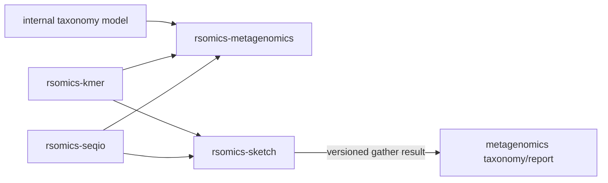

# Metagenomics and sequence-sketch product dossier

Status: source and upstream-operation audit complete. Neither target repository
has been created.

## Boundary decision

`rsomics-metagenomics` and `rsomics-sketch` remain separate products.

- `rsomics-metagenomics` owns abundance-aware amplicon processing, taxonomic
  database construction and read classification, taxonomy, and classification
  reports.
- `rsomics-sketch` owns persistent sequence sketches, sketch comparison,
  similarity and containment search, indexing, and sketch-based mixture
  decomposition.

The distinction is the durable data model and installation identity, not the
fact that both use k-mers. A sketch is a bounded probabilistic summary intended
to be stored, exchanged, indexed, and searched across genomes, reads, or
metagenomes. A Kraken-style classifier uses a taxonomy-labelled minimizer
database and assigns individual reads. VSEARCH-style amplicon operations use
exact sequences and `;size=N` abundance semantics. Combining those into one
binary would not remove a shared model; it would place three different models
behind one name.

The products may interoperate through declared files. For example, a later
sketch `gather` result can be summarized taxonomically by
`rsomics-metagenomics` without either Layer B crate depending on the other.



`rsomics-fastx-sort --sortbylength` is not duplicated in metagenomics. Generic
FASTA/FASTQ length sorting belongs to the planned `rsomics-seq sort` operation.
Only abundance-aware sorting used by amplicon workflows remains here.

## `rsomics-metagenomics`

### Boundary and upstream scope

The primary upstream behavior sources are:

- [VSEARCH 2.31.0](https://github.com/torognes/vsearch) for exact amplicon
  dereplication, abundance sorting, rereplication, clustering, chimera
  detection, paired-read merging, and reference search;
- [Kraken 2 2.17.1](https://github.com/DerrickWood/kraken2) for minimizer
  database construction, taxonomy-labelled read classification, confidence
  filtering, paired input, standard classification output, and taxonomic
  reports;
- NCBI Taxonomy `nodes.dmp`, `names.dmp`, `merged.dmp`, and `delnodes.dmp` for
  the initial classifier taxonomy profile.

VSEARCH is broader than this product. Generic FASTA/FASTQ conversion, sampling,
shuffling, length sorting, and non-domain-specific filtering remain in
`rsomics-seq` or `rsomics-fastq-preprocess`. This product retains the operations
whose observable contract depends on abundance-labelled amplicons, OTU/ASV
workflows, a reference taxonomy, or taxonomic classification.

### Initial amplicon slice

| Target subcommand | Upstream operation | Initial stable surface |
|---|---|---|
| `dereplicate` | VSEARCH `fastx_uniques`, `derep_fulllength`, and `derep_prefix` | strict FASTA input; full-length or prefix mode; optional input abundance; checked min/max length; stable representative, abundance, label, ordering, and wrapping profiles |
| `sort-abundance` | VSEARCH `sortbysize` | decreasing `;size=N` abundance; checked minimum, maximum, and top-N filters; stable header tie-break and output annotation profiles |
| `rereplicate` | VSEARCH `rereplicate` | ordered expansion of abundance-labelled FASTA; checked expansion budget; optional `;size=1` output profile |

VSEARCH now prefers `fastx_uniques` over the deprecated
`derep_fulllength` spelling. The target uses one `dereplicate` command and
names the selected compatibility profile rather than preserving both upstream
spellings as separate public commands.

The initial release is intentionally an amplicon abundance lifecycle. The
historical report parser does not force an unrelated `report` command into that
release, and the unvalidated historical classifier does not reserve a visible
`classify` placeholder.

### Classification and reporting slice

| Target surface | Upstream operation | Gate |
|---|---|---|
| `database build` | Kraken 2 database build | sequence-to-taxid mapping, taxonomy revision, `k`, minimizer length, spaced-seed mask, hash seed, capacity/load factor, duplicate handling, deterministic manifest, and integrity checks |
| `database inspect` | `kraken2-inspect` | database parameters, taxonomy tree, direct/clade minimizer counts, and streaming report output |
| `classify` | `kraken2`; current `k2 classify` behavior where selected | nucleotide single/paired input, minimizer hit groups, LCA resolution, confidence threshold, quick mode if implemented, classified/unclassified streams, and five-column output |
| `report` | Kraken 2 standard and minimizer-data reports | checked six- and eight-column profiles, hierarchy, rank, direct/clade counts, percentages, zero-count policy, top/filter/convert operations, and MPA-style output when implemented |
| `report merge` | current Kraken multi-database result/report behavior | compatible taxonomy and database provenance, LCA merge, identity-preserving read order, and recomputed report totals |
| `summarize-sketch` | sourmash gather CSV plus declared taxonomy input | non-overlapping match fractions, NCBI or GTDB lineage profile, rank aggregation, unmatched fraction, and provenance-preserving output |

The first classification release may support a narrower database source and
option profile than Kraken 2. It cannot call a plain hash-to-taxid TSV a Kraken
database, and it cannot advertise classification until database construction,
classification, and reporting form one tested slice.

### Later amplicon operations

| Operation group | Upstream anchors | Required boundary |
|---|---|---|
| paired-read preparation | VSEARCH `fastq_mergepairs`, `fastq_join`, and related report outputs | paired identity, overlap, mismatch, quality-score, stagger, and rejected-read contracts shared with `rsomics-seqio` |
| quality filtering | VSEARCH expected-error and length filters | only amplicon-specific profiles; generic trimming/filtering remains in `rsomics-fastq-preprocess` |
| clustering | VSEARCH `cluster_fast`, `cluster_size`, `cluster_smallmem`, and UNOISE-style clustering | centroid/order policy, strand, identity definition, abundance, OTU/UC outputs, and deterministic parallel scheduling |
| chimera detection | VSEARCH `uchime_denovo`, `uchime2_denovo`, `uchime3_denovo`, and `uchime_ref` | parent ordering, abundance skew, scoring parameters, reference provenance, and chimeric/non-chimeric outputs |
| reference search | VSEARCH `usearch_global` in amplicon/marker workflows | identity definition, strand, masking, acceptance/rejection, top-hit ordering, and declared tabular outputs |
| feature tables | VSEARCH OTU, BIOM, mothur, and profile outputs | checked sample/feature identities and an explicit handoff to `rsomics-ecology` |

An upstream option becomes public only with the operation that owns it. The
product does not expose a flat copy of every VSEARCH global flag.

### Amplicon sequence and abundance contract

- `rsomics-seqio` supplies strict streaming FASTA/FASTQ records and the common
  compression and stdin/stdout contract. The three historical private FASTA
  parsers are removed.
- The initial abundance profile recognizes one declared semicolon-delimited
  `size` attribute. Missing, duplicate, malformed, zero, overflowing, and
  out-of-range values have explicit strict and VSEARCH-compatibility behavior.
- Full-length dereplication declares case folding, `T`/`U` equivalence, strand,
  representative selection, input abundance, output abundance, label
  truncation, and stable tie order.
- Prefix dereplication uses the same record and abundance model. Prefix
  replacement, equal sequences, multiple candidate prefixes, and input-order
  ties are oracle-tested rather than inferred from one implementation.
- Abundance addition uses checked arithmetic. A debug-build panic or
  release-build wrap is not a compatibility policy.
- Rereplication validates the total record and byte expansion before committing
  a named output. An explicit override is required above a documented
  expansion limit.
- Operations whose result necessarily requires all records may buffer owned
  records, but they do not also retain duplicate normalized sequences, raw
  records, and output buffers without a measured reason.
- Named outputs use the shared transactional output boundary. A late parse,
  overflow, or write failure leaves an existing destination unchanged.

### Taxonomy, database, and classification contract

- One internal taxonomy type owns unique taxon IDs, a checked root, valid
  parent targets, scientific names, ranks, deleted IDs, merged-ID resolution,
  and cycle-free lineage. Its maps are not publicly mutable.
- Loading taxdump fails on duplicate nodes, duplicate scientific names,
  missing parents, missing names required by the selected profile, merged
  cycles, unresolved merged targets, and lineage cycles. Hop limits are safety
  backstops that return errors, not silent truncation rules.
- A database manifest records format version, taxonomy source and hashes,
  library source and hashes, nucleotide/protein mode, `k`, minimizer length,
  spaced-seed mask, hash algorithm and seed, capacity, build revision, and
  byte order.
- Database files carry integrity metadata and are committed as one transaction.
  Classification rejects a missing, mixed-version, truncated, or
  parameter-incompatible database before reading queries.
- Ambiguous sequence windows reset minimizer state under a named policy.
  Iterator errors are propagated; `flatten()` is not used to erase them.
- Read assignment is based on ordered minimizer hit groups and LCA semantics,
  not the taxon with the largest unweighted exact-k-mer count. Confidence,
  minimum hit groups, and quick mode are separate declared policies.
- Paired reads preserve mate identity and length accounting. The classifier
  records whether mates are joined logically, classified independently, or
  rejected as an invalid pair.
- Standard output contains classification status, sequence identity, assigned
  taxon, classified sequence length, and the hit-list field. Optional output
  files preserve the input record and description according to the declared
  profile.

### Report contract

- The standard report profile has exactly six logical fields: clade percentage,
  clade count, direct count, rank code, taxon ID, and an indentation-bearing
  scientific name. The minimizer-data profile adds total and distinct
  minimizer counts in the documented positions.
- Percentages are finite and within the declared range. Direct counts do not
  exceed clade counts, child totals and indentation are checked where the
  profile permits, and report totals agree with classification provenance.
- Rank codes, indentation, scientific names, and taxon IDs remain distinct
  fields. Trimming a name does not destroy hierarchy.
- Filtering and top-N views preserve the source tree or state explicitly that
  the result is a flat ranking. Equal-count ties have a stable documented
  order.
- Report conversion is streaming where the output permits. A report need not
  be loaded into a vector merely to filter a rank or change serialization.

### Target structure

```text
src/
├── cli.rs
├── amplicon/
│   ├── abundance.rs
│   ├── dereplicate.rs
│   ├── rereplicate.rs
│   ├── sort.rs
│   ├── cluster.rs
│   └── chimera.rs
├── taxonomy/
│   ├── model.rs
│   ├── ncbi.rs
│   └── lineage.rs
├── database/
│   ├── builder.rs
│   ├── manifest.rs
│   ├── minimizer.rs
│   └── reader.rs
├── classify/
│   ├── hit_groups.rs
│   ├── assign.rs
│   └── output.rs
└── report/
    ├── kraken.rs
    ├── tree.rs
    ├── summarize.rs
    └── sketch.rs
```

This is a module map, not a request to create empty files. Later directories
appear only with an implemented slice.

### Foundation relationships

- `rsomics-common` supplies the execution, structured result, diagnostics, and
  transactional output contracts.
- `rsomics-help` is mandatory for the product command tree. The target derives
  help from Clap metadata through the current shared layer; it does not carry a
  private `HelpSpec`.
- `rsomics-seqio` supplies strict FASTA/FASTQ and compression. This is a
  concrete product consumer alongside sequence and preprocessing.
- `rsomics-kmer` may supply checked DNA rolling-hash and minimizer primitives
  to `database::minimizer`, but only after consumer-side classifier tests show
  the exact contract. Current exact-count APIs and the old classifier do not
  justify a speculative foundation change.
- `rsomics-taxonomy` is refactored then internalized. The historical code has
  only this target-product consumer after consolidation. A versioned gather
  interchange does not make `rsomics-sketch` a taxonomy-library consumer.

### Historical asset disposition

| Historical asset | Audited revision | Disposition |
|---|---|---|
| `rsomics-derep` | `f3663ce011e8f65ec5bcc227a495165b12ab7dd0` | refactor then merge into `amplicon::dereplicate`; retain full/prefix algorithms, golden fixtures, header tie cases, and VSEARCH differential inputs; replace parser, output, arithmetic, CLI, and comment density |
| `rsomics-fastx-sort` | `ab7377cd840d2ca97d659a15cc404a90b91f9e69` | split by policy: refactor `sortbysize` into `sort-abundance`; route length-sort fixtures and semantics to `rsomics-seq sort`; retain the 500,000-record benchmark clue; replace parser/output/CLI |
| `rsomics-rereplicate` | `40e2fb78e9ef2c1f6e632583e925923baf1d9730` | refactor then merge into `amplicon::rereplicate`; retain byte goldens and VSEARCH cases; replace whole-file parser, unchecked expansion, duplicate header logic, output, and CLI |
| `rsomics-kraken-report` | `bf1e47d687ff3fe7bd0d87535819ffcacd0bf22b` | refactor then merge into `report`; retain malformed-number tests and top-rank seed; reconstruct six/eight-column types, hierarchy, validation, streaming, formats, and oracle coverage |
| `rsomics-tax-assign` | `b611492cd6f1a8535991f3fbb4178300a1b0ecdc` | discard the production implementation; retain only tiny FASTQ/database fixtures if useful for negative tests |
| `rsomics-taxonomy` | `996982d4fead6e8ed8a4ff738d0f00d67c8fcd7e` | refactor then internalize; retain taxdump parsing, lineage/LCA seeds, merged-ID fixtures, and error types; replace public mutable state and incomplete validation |

### Audit findings that block direct consolidation

1. The three VSEARCH ports independently implement nearly identical FASTA,
   `;size=N`, wrapping, and direct-file output code.
2. Their parsers accept sequence text before the first header, do not enforce
   one common empty-label/empty-sequence policy, and load all records before
   returning an iterator-like value.
3. Dereplication abundance sums, prefix bucket sums, summary totals, and
   rereplication output counts use unchecked `u64` addition. Rereplication has
   no expansion limit.
4. Parallel full-length dereplication first materializes all raw records and a
   second normalized collection, then performs the central hash merge
   serially. The thread flag therefore needs new memory and scaling evidence.
5. The `rsomics-fastx-sort` dependency on Rayon is unused. Its accepted
   `--sizein` flag has no effect, and minimum/maximum filter relationships are
   not validated before output creation.
6. `rsomics-rereplicate` advertises a thread flag inherited from common
   plumbing even though the implementation is single-threaded.
7. All three VSEARCH CLIs omit the mandatory `rsomics-help` layer. The other
   related CLIs duplicate the obsolete static `HelpSpec`.
8. The VSEARCH live differentials return success after printing `SKIP` when
   the oracle is unavailable. Committed goldens are valuable regressions but
   do not prove the current source revision against the current oracle.
9. `rsomics-tax-assign` describes itself as k-mer LCA classification but never
   uses its taxonomy dependency. It chooses the taxon with the largest exact
   hit count from an unversioned two-column TSV.
10. That classifier has no database builder or manifest, ignores malformed
    rows with fewer than two fields, overwrites duplicate k-mers, cannot prove
    the requested `k` matches the database, and silently drops ambiguous-window
    iterator errors through `flatten()`.
11. Its four-column output is not Kraken's five-column format. It has no
    minimizers, spaced seeds, hit groups, LCA assignment, confidence, paired
    semantics, read length field, hit list, database integrity, or real oracle.
12. `rsomics-kraken-report` treats any six-or-more-column row as a standard
    report and joins surplus columns into the name. It therefore misreads the
    documented eight-column minimizer profile and destroys indentation by
    trimming the name.
13. The report parser does not validate percentages, ranks, taxon identity,
    tree shape, count relationships, or report totals. Its public entry type
    permits unchecked construction.
14. `rsomics-taxonomy` exposes mutable node maps and a default empty taxonomy.
    Duplicate nodes overwrite, missing parent/name relationships survive, and
    merged or lineage cycles end at silent hop caps rather than errors.
15. Every named output is opened with direct `File::create`, so a late parse,
    overflow, or write failure can truncate an existing destination.
16. All seven related repositories run only Ubuntu CI. No repository proves
    native Linux and macOS behavior on both `x86_64` and `aarch64`.
17. Source comments repeatedly narrate upstream behavior, implementation
    steps, and obvious record fields. Selected non-obvious compatibility
    invariants are retained without carrying that density into the target.

### Compatibility plan

Required oracle jobs install the pinned oracle and fail if it cannot run.

| Operation | Pinned oracle | Required evidence |
|---|---|---|
| full-length dereplication | VSEARCH 2.31.0 `fastx_uniques` and compatibility `derep_fulllength` profile | case, `T`/`U`, ambiguity, input/output abundance, duplicate/malformed size attributes, representative, labels, ties, length filters, top/min/max abundance, wrapping, and randomized FASTA |
| prefix dereplication | VSEARCH 2.31.0 `derep_prefix` | multiple/equal prefixes, ordering, abundance transfer, hash collisions, filtered records, ties, and randomized prefix families |
| abundance sort | VSEARCH 2.31.0 `sortbysize` | missing/invalid abundance, tie order, filters, top-N, label attributes, wrapping, empty input, and randomized records |
| rereplication | VSEARCH 2.31.0 `rereplicate` | absent/zero/large abundance, label rewriting, size output, wrapping, order, expansion refusal, and byte-exact normal cases |
| taxonomy | pinned NCBI taxdump snapshot plus Kraken 2.17.1 taxonomy build | duplicate/missing/cyclic nodes, merged/deleted IDs, ranks/names, lineage/LCA, hashes, and randomized valid trees |
| database build/inspect | Kraken 2.17.1 | parameters and manifest, minimizer-to-LCA assignments, compact table behavior, direct/clade minimizer counts, deterministic small database, corruption, and parameter mismatch |
| classification | Kraken 2.17.1 | single/paired FASTA/FASTQ, ambiguity, short reads, confidence boundaries, ties/LCA, quick mode if present, output streams, hit list, randomized synthetic references, and selected real data |
| reports | Kraken 2.17.1 | standard six-column, eight-column minimizer, zero-count, hierarchy, rank filtering, MPA profile if present, classification-to-report totals, and multi-database merge |
| sketch taxonomy handoff | sourmash 4.9.4 gather/tax declared profiles | identifiers, unique fractions, rank aggregation, unmatched fraction, NCBI/GTDB lineage, malformed provenance, and output schema |

VSEARCH behavior that intentionally accepts a malformed or unusual header is
kept behind a named compatibility profile. The strict default never turns an
invalid abundance into one silently unless that behavior is explicitly part
of the selected profile.

### Performance and memory plan

The historical sort README reports 1.76 and 1.78 times the VSEARCH throughput
on 500,000 records and 46 MB, and rereplication reports 3.65 times on 50,000
amplicons expanding 8.7 MB to 88 MB. Those measurements identify useful
fixtures but omit complete raw distributions, input hashes, RSS, and current
source provenance.

- Re-run full and prefix dereplication on low- and high-duplication amplicon
  sets. Record input/output cardinality, normalization storage, thread scaling,
  timing distribution, and peak RSS against VSEARCH 2.31.0.
- Re-run abundance sorting with enough records and header bytes to expose both
  comparison cost and resident storage. Compare the same filters and output.
- Re-run rereplication at modest and large expansion factors. Separate parsing
  from unavoidable output bytes and record rejected expansion before any named
  destination changes.
- Measure database construction against Kraken 2.17.1 on a small exact oracle
  database and a representative reference collection. Report capacity,
  minimizer count, database bytes, temporary bytes, build time, and peak RSS.
- Measure classification thread-for-thread on short single/paired reads and a
  representative long-read set. Report classified identities, report hashes,
  reads and bases per second, decompression, database load/mapping time, and
  peak RSS.
- Measure report parsing and conversion on a large hierarchy in streaming and
  materialized modes. Top/filter convenience must not force unbounded duplicate
  storage.

Every record includes machine, operating system, versions, source revisions,
input and database hashes, commands, CPU/thread controls, timing distribution,
peak RSS, output hashes, and correctness result. An established replacement
operation needs a strict throughput or material resource-use advantage on its
relevant hot path.

### Release sequence

1. Create the target repository only when the amplicon slice is ready to
   migrate.
2. Share strict FASTA and output transactions through `rsomics-seqio` and
   `rsomics-common`; define one checked abundance/header type.
3. Refactor and merge `dereplicate`, `sort-abundance`, and `rereplicate` with
   the current `rsomics-help` command tree.
4. Run format, strict Clippy, unit, golden, mandatory live-VSEARCH,
   end-to-end abundance round-trip, representative performance/RSS, and four
   native-target exact-head gates.
5. Publish only that complete amplicon slice. Do not show `database`,
   `classify`, `report`, clustering, or chimera placeholders.
6. Reconstruct and internalize the taxonomy model; build a deterministic small
   database and the complete build/inspect/classify/report slice.
7. Add paired classification, confidence profiles, larger database gates, and
   current multi-database behavior before making broader Kraken replacement
   claims.
8. Add clustering, chimera, amplicon search, feature-table output, and sketch
   taxonomy handoff as separate complete slices.

### Explicit exclusions

- No historical micro-crate name is revived.
- `rsomics-taxonomy` is not republished during this wave.
- The historical exact-k-mer vote classifier is not exposed as an
  “experimental” command and is not described as Kraken2 or Centrifuge
  compatible.
- Generic length sorting, sampling, shuffling, FASTA/Q conversion, and
  validation remain in `rsomics-seq`.
- General read trimming and filtering remain in
  `rsomics-fastq-preprocess`.
- Community diversity, ordination, and permutation statistics remain in
  `rsomics-ecology`.
- Persistent sketches, sketch indexes, and sketch search remain in
  `rsomics-sketch`.
- The first release does not claim complete VSEARCH, USEARCH, Kraken 2,
  Centrifuge, Bracken, QIIME 2, or sourmash replacement.

## `rsomics-sketch`

### Boundary and upstream scope

The primary behavior sources are:

- [Mash 2.3](https://mash.readthedocs.io/) for fixed-size MinHash `sketch`,
  `dist`, `screen`, `info`, and `paste` semantics and Mash distance/p-value
  calculations;
- [sourmash 4.9.4](https://sourmash.readthedocs.io/en/stable/) for
  FracMinHash signatures, abundance tracking, `sketch`, `compare`, `search`,
  `prefetch`, `gather`, collection manifests, and indexed search.

The initial product is DNA-only. Protein, dayhoff, hp, and skip-mer molecule
profiles are later slices because their alphabet, hash, `k`, compatibility,
and ANI semantics differ from canonical DNA.

### Initial persistent-sketch slice

| Target subcommand | Upstream operation | Initial stable surface |
|---|---|---|
| `sketch` | sourmash `sketch dna`; Mash `sketch` as a secondary oracle | streaming canonical-DNA FracMinHash; selected `k`, scaled value, seed, optional abundance; one pinned sourmash signature profile |
| `inspect` | sourmash signature describe/manifest; Mash `info` | parameters, identity, source metadata, digest, hash count, abundance state, and integrity validation |
| `compare` | sourmash `compare`; Mash `dist` where mathematically aligned | Jaccard similarity, containment in both directions, ANI only under a declared estimator, pair-list and labelled matrix output |
| `search` | sourmash `search` without an index | one query against a signature collection; similarity or containment threshold, stable ranking, selection, and complete tabular result |

The release stores a real bounded sketch. It does not call an exact
`HashMap<kmer,count>` a sketch, and it does not require all raw distinct k-mers
to remain resident after sketch construction.

The initial interoperability target is a pinned sourmash 4.9.4 signature
profile. Mash-compatible fixed-size sketches and `.msh` interchange are a
later profile rather than an undocumented mix of Mash formulas with a private
file.

### Later sketch operations

| Target surface | Upstream operation | Gate |
|---|---|---|
| `sketch --num` and Mash interchange | Mash fixed-size MinHash | hash/seed, sketch-size truncation, reads/genome modes, multiplicity, `.msh` format, and byte or semantic round trip |
| `screen` | Mash `screen` | query multiplicity, identity, winner/taxonomic modes if selected, p-value, filtering, and read-set behavior |
| `collection` | sourmash signature manipulation and manifests; Mash `paste` | merge/select/rename/subtract where mathematically valid, compatible parameters, stable identity, and provenance |
| `index` | sourmash indexed collections | format version, manifest, selector, transactional construction, integrity, update policy, query equivalence, and disk/RSS evidence |
| `prefetch` | sourmash `prefetch` | containment threshold, overlap bases, scaled compatibility, deterministic candidate set, and result schema |
| `gather` | sourmash `gather` | iterative non-overlapping decomposition, abundance weighting, threshold, recovery totals, tie order, and versioned handoff output |

Taxonomic aggregation of `gather` results remains in
`rsomics-metagenomics summarize-sketch`. Plotting a comparison matrix is not a
reason to add a plotting subsystem to this product.

### Sketch and signature contract

- A signature records format version, molecule type, `k`, hash function, seed,
  selection kind, scaled or fixed-size parameter, maximum accepted hash,
  abundance state, source identity, display name, filename where relevant,
  source hashes, and a content digest.
- Hashes are sorted and unique. Abundance counts are checked nonzero integers
  attached to retained hashes only. Deserialization validates order,
  uniqueness, range, parameter consistency, digest, and numeric limits.
- Canonical DNA windows use one pinned strand and hash definition. Ambiguous
  bases break the rolling window and skip exactly the affected windows.
  Malformed sequence records and iterator failures remain errors.
- Files shorter than `k`, empty inputs, collections containing no retained
  hash, and comparisons between empty sketches receive explicit
  upstream-profile semantics.
- Downsampling between compatible scaled sketches is deterministic and never
  manufactures hashes. Incompatible molecule, `k`, seed, hash, or abundance
  profiles fail before comparison.
- Similarity, containment, Mash distance, ANI, and p-value are distinct typed
  measures. A formula is emitted only when its assumptions and finite domain
  hold; unavailable values carry a reason in structured output.
- Sketch creation is deterministic across native platforms and declared
  thread counts. Stable file bytes do not depend on hash-map iteration order.
- Named signatures, collections, indexes, and matrices use transactional
  output.

### Collection, search, and gather contract

- A collection manifest has stable signature identities and selectors.
  Duplicate identities, duplicate content under conflicting metadata, and
  selectors matching zero or multiple incompatible signatures are explicit
  outcomes.
- Search records query and target identity, measure, threshold, overlap or
  estimated shared hashes, compatible parameters, and stable tie ordering.
- Linear and indexed search return equivalent candidate and score sets under
  the same profile. Approximate index behavior, if any, receives a different
  declared mode.
- Gather iteratively assigns query hashes without counting one query hash
  toward more than one recovered match. It records unique and total query
  fractions, remaining hashes, rank, threshold, and abundance-weighted values
  where supported.
- A versioned gather table is the interoperability boundary with
  `rsomics-metagenomics`. Neither product imports the other product crate.

### Target structure

```text
src/
├── cli.rs
├── signature/
│   ├── model.rs
│   ├── sourmash.rs
│   └── validate.rs
├── sketch/
│   ├── dna.rs
│   ├── fracminhash.rs
│   └── minhash.rs
├── compare/
│   ├── measures.rs
│   ├── matrix.rs
│   └── ani.rs
├── collection/
│   ├── manifest.rs
│   ├── select.rs
│   └── index.rs
└── search/
    ├── linear.rs
    ├── indexed.rs
    └── gather.rs
```

### Foundation relationships

- `rsomics-common`, `rsomics-help`, and `rsomics-seqio` provide the same
  execution, CLI, sequence-stream, compression, and transactional-output
  contracts used by other products.
- `rsomics-kmer` is reviewed through concrete calls from
  `sketch::dna` for canonical rolling hashes and from the future
  metagenomics minimizer builder. Consumer tests must pin ambiguity reset,
  `k` limits, canonicalization, hash seed, and byte order before any public
  item changes.
- FracMinHash, signatures, search indexes, ANI policy, and gather remain
  product-internal. No new public `minhash`, `distance`, `signature`, or
  taxonomy foundation is created during the first slice.

### Historical asset disposition

| Historical asset | Audited revision | Disposition |
|---|---|---|
| `rsomics-kmer-dist` | `7eb179076a1bb6ecdbfc85e9624e96e5a1060e7b` | test, formula, and baseline asset only; retain small Jaccard/Bray-Curtis/cosine fixtures if useful; discard the production profile loader, CLI, and “sketch” implication |

The current `rsomics-kmer` revision
`4258ac881119bcee69a3541119bb3e544500743a` is a foundation under review, not
a second historical product asset.

### Audit findings that block direct consolidation

1. `rsomics-kmer-dist` stores an exact `HashMap<u64,u64>` for every distinct
   canonical k-mer. Its memory is proportional to input diversity rather than
   a fixed or scaled sketch.
2. It has no MinHash or FracMinHash selection, persistent signature, sketch
   parameters, source provenance, collection, index, search, gather, Mash
   distance, p-value, or ANI contract.
3. Pairwise comparison loads every sample's complete exact profile
   simultaneously and creates two additional key sets for each Jaccard
   comparison.
4. Invalid k-mer windows are silently discarded with `flatten()`. A short
   sequence can fail the whole input while an ambiguity-bearing window is
   ignored, so the sequence policy is neither strict nor a declared sketch
   profile.
5. Count and sum arithmetic is unchecked. Empty-profile Jaccard returns zero
   distance while cosine returns one, without a typed degenerate policy.
6. Output uses file basenames and six-decimal pair rows, which can collide and
   cannot reconstruct a labelled matrix or the sketch parameters.
7. Tests verify local formulas only. There is no real Mash or sourmash oracle,
   persistent-format round trip, representative memory gate, or performance
   evidence.
8. The CLI duplicates the obsolete help model, writes named output directly,
   and runs only Ubuntu CI.

### Compatibility plan

| Operation | Pinned oracle | Required evidence |
|---|---|---|
| FracMinHash sketch | sourmash 4.9.4 | retained hashes and optional abundances, canonical DNA, ambiguity, short/empty input, `k`, scaled, seed, metadata, digest, randomized FASTA/FASTQ, and pinned signature round trip |
| inspect and selection | sourmash 4.9.4 signature/manifest commands | all parameters and identities, invalid order/digest/range, multiple signatures, selectors, compression, and byte/semantic preservation |
| compare | sourmash 4.9.4; Mash 2.3 for aligned fixed-size formulas | Jaccard, directional containment, downsampling, empty/incompatible sketches, ANI domain, labelled matrix order, and randomized pairs |
| linear search | sourmash 4.9.4 | thresholds, similarity/containment modes, scaled compatibility, selection, ties, identifiers, complete result columns, and randomized collections |
| fixed-size/Mash profile | Mash 2.3 | retained hashes, multiplicity, reads/genome mode, `.msh` interoperability, `dist` distance/p-value, `screen`, info, and paste |
| index/prefetch/gather | sourmash 4.9.4 | linear/index equivalence, selectors, corruption, overlap thresholds, iterative unique recovery, abundance weighting, ties, and result handoff |

Oracle jobs fail when a required executable, Python package, or fixture is
missing. Independent mathematical tests accompany differentials so an
upstream regression does not become the only specification.

### Performance and memory plan

- Measure sketch construction against sourmash 4.9.4 and Mash 2.3 on genomes,
  assemblies, read sets, and a metagenome. Report bases per second, retained
  hashes, input decompression, thread count, and peak RSS.
- Sweep input size and distinct k-mer diversity at fixed sketch parameters.
  Peak memory must follow the declared sketch bound rather than the historical
  exact-profile baseline.
- Measure pairwise comparison at enough signatures to expose quadratic work.
  Separate signature loading, scoring, matrix storage, and serialization.
- Measure linear search over increasing collection sizes. Later compare the
  index build cost, index bytes, load/RSS, warm and cold query distributions,
  and exact result equivalence.
- Measure gather on queries with known overlapping references, redundant
  databases, and abundance tracking. Correct non-overlapping recovery is a
  gate before speed.
- Record source revisions, machine, operating system, inputs and hashes,
  oracle versions, exact commands, CPU/thread controls, timing distributions,
  peak RSS, output hashes, and compatibility results.

### Release sequence

1. Review the exact sourmash signature profile and the `rsomics-kmer`
   consumer boundary before creating public types.
2. Create the product repository with the current `rsomics-help`,
   `rsomics-common`, and `rsomics-seqio` layers.
3. Implement one deterministic DNA FracMinHash builder and validated persistent
   signature; add `inspect`, `compare`, and linear `search`.
4. Run format, strict Clippy, unit, property, persistent-format, mandatory live
   sourmash, selected Mash formula, integration, representative
   performance/RSS, and four-native-target exact-head gates.
5. Publish only the complete persistent-sketch slice. Do not show index,
   gather, Mash interchange, protein, or taxonomy placeholders.
6. Add the fixed-size Mash profile and `.msh` interoperability as a complete
   slice if it provides a material user benefit beyond the FracMinHash path.
7. Add collection indexing, prefetch, and gather with linear equivalence and
   database-scale performance gates.
8. Add molecule profiles only after separate alphabet, hash, compatibility,
   and estimator reviews.

### Explicit exclusions

- The exact `rsomics-kmer-dist` implementation is not published under the new
  product name.
- The first release does not claim complete Mash or sourmash replacement.
- Exact k-mer tables and general sequence k-mer output remain in
  `rsomics-seq kmers`.
- Read-level taxonomic classification, taxonomy databases, Kraken reports, and
  gather taxonomy aggregation remain in `rsomics-metagenomics`.
- Community diversity and ecological distance matrices remain in
  `rsomics-ecology`.
- Plotting is not part of the first product. Comparison and search emit
  reusable typed tables and structured results.
- No public MinHash, signature, matrix, ANI, collection, or taxonomy crate is
  added without two implemented product consumers.

## License and attribution

VSEARCH is currently dual-licensed under GPL-3.0 or BSD-2-Clause; this project
uses the BSD-2-Clause path for any upstream source-derived work. Kraken 2 is
MIT licensed. sourmash is BSD-3-Clause. Mash and its bundled components require
component-level notice review before source reuse or binary redistribution.

The team-owned historical Rust implementations may be reused directly under
the confirmed project license. Every migrated operation still records the
upstream version, behavior source, paper where applicable, license path, and
retained notices. Database and taxonomy content licenses are reviewed
separately from the software license.
