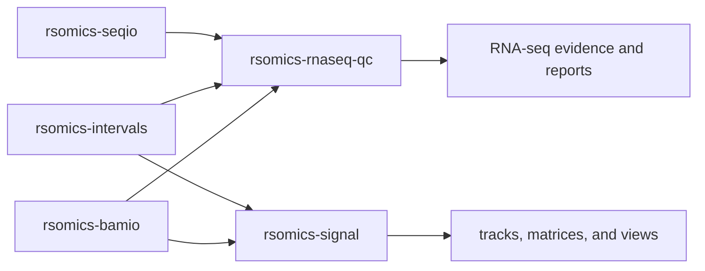

# RNA-seq QC and signal product dossiers

This joint audit separates two workflows that often read the same BAM files
but do not have the same user contract. `rsomics-rnaseq-qc` explains whether an
RNA-seq library and alignment are trustworthy. `rsomics-signal` creates,
combines, summarizes, and visualizes genome-wide signal tracks.

Neither product owns generic SAM/BAM/CRAM format operations. Both consume
`rsomics-bamio`; neither depends on the Layer B `rsomics-bam` product.

## `rsomics-rnaseq-qc`

### Boundary and upstream scope

`rsomics-rnaseq-qc` is one report-oriented RNA-seq quality-control product. It
combines mapping, annotation distribution, strandedness, splice junction,
fragment, saturation, coverage-bias, sequence-bias, and transcript-integrity
evidence without requiring one installation per metric.

The primary behavior sources are:

- [RSeQC 5.0.5](https://pypi.org/project/RSeQC/), including the exact wheel
  script inventory and the [RSeQC documentation](https://rseqc.sourceforge.net/);
- [Picard 3.4.0](https://github.com/broadinstitute/picard/releases/tag/3.4.0)
  `CollectRnaSeqMetrics`;
- the [RSeQC method paper](https://doi.org/10.1093/bioinformatics/bts356);
- the [TIN method paper](https://doi.org/10.1186/s12864-016-2539-1);
- SAM/BAM, BED12, refFlat, and Picard interval-list contracts.

The 5.0.5 RSeQC wheel contains 33 scripts. They partition by workflow rather
than by their historical package membership:

| RSeQC operation group | Target |
|---|---|
| RNA-seq mapping and QC metrics | `rsomics-rnaseq-qc` |
| `FPKM_count`, `FPKM-UQ` | `rsomics-count` |
| `bam2fq`, `divide_bam`, `split_bam`, `split_paired_bam` | `rsomics-bam` |
| `bam2wig`, `normalize_bigwig`, `overlay_bigwig` | `rsomics-signal` |
| `sc_bamStat`, `sc_editMatrix`, `sc_seqLogo`, `sc_seqQual` | `rsomics-sc` |

This accounts for every shipped script without treating RSeQC itself as a
public crate boundary.

### Operation map

The normal entry point is a coordinated report:

```text
rsomics-rnaseq-qc report --bam sample.bam --genes genes.bed12 --out sample-qc
```

Focused subcommands retain independently useful contracts and allow exact
upstream comparisons.

| Target subcommand | Upstream operations | Contract |
|---|---|---|
| `report` | selected RSeQC metrics; Picard `CollectRnaSeqMetrics` | one declared metric set, shared scan where semantics permit, manifest plus machine-readable and tabular outputs |
| `mapping` | `bam_stat`; Picard alignment fields | mapping, pairing, splice, duplicate, QC-fail, strand, and MAPQ categories |
| `strandedness` | `infer_experiment` | protocol evidence and usable/ambiguous fractions |
| `distribution` | `read_distribution`; Picard region metrics | exon, CDS, UTR, intron, intergenic, TSS, TES, and optional rRNA assignment |
| `coverage` | `geneBody_coverage`, `geneBody_coverage2` | per-sample 5-prime to 3-prime gene-body coverage and multi-sample comparison |
| `junctions` | `junction_annotation`, `junction_saturation` | known, partial-novel, and novel junction evidence plus depth saturation |
| `fragments` | `inner_distance`, `RNA_fragment_size` | library-level inner-distance distribution and per-transcript fragment summaries |
| `bias` | `clipping_profile`, `deletion_profile`, `insertion_profile`, `mismatch_profile`, `read_GC`, `read_NVC`, `read_quality`, `read_hexamer` | per-cycle alignment, base, quality, GC, and primer-bias evidence |
| `duplication` | `read_duplication` | sequence and position duplication distributions |
| `saturation` | `RPKM_saturation` | deterministic subsampling and gene-detection/abundance saturation |
| `integrity` | `tin` | per-transcript and sample-level TIN summaries |

`report` does not silently run every expensive metric. A named preset expands
to a printed metric plan, and the execution report records the expansion,
filters, sampling, seed, annotation identity, and omitted metrics.

### Shared data model and execution

- BAM headers, records, reference identifiers, CIGAR operations, and auxiliary
  fields cross one checked `rsomics-bamio` boundary.
- BED12 and refFlat inputs become validated transcript, exon, CDS, and UTR
  models. Coordinate conversion happens once.
- A read-filter policy explicitly controls unmapped, secondary,
  supplementary, duplicate, QC-fail, MAPQ, pairing, and read-group handling.
  Each metric records whether it uses the shared policy or an upstream
  compatibility policy.
- Coverage blocks use complete CIGAR semantics. Historical RSeQC behavior that
  advances reference position for soft clipping or ignores `=` and `X` is
  available only under a pinned compatibility profile after a current 5.0.5
  oracle test.
- The report planner groups metrics only when they have compatible filters and
  traversal requirements. It does not claim a single scan while performing
  repeated indexed queries.
- Sampling is deterministic when a seed is supplied. The execution report
  records the exact sample population and selection method.
- Multi-file outputs are staged and published as one set. A failed metric
  cannot leave a report manifest pointing at partial tables.
- Tables are first-class outputs. Optional HTML, SVG, or PDF views are derived
  from the same recorded data rather than emitted only through generated R
  scripts.

### Target structure

```text
src/
├── cli.rs
├── report/
│   ├── plan.rs
│   ├── run.rs
│   └── manifest.rs
├── annotation/
│   ├── bed12.rs
│   ├── refflat.rs
│   └── model.rs
├── alignments/
│   ├── filters.rs
│   ├── blocks.rs
│   └── sampling.rs
├── metrics/
│   ├── mapping.rs
│   ├── strandedness.rs
│   ├── distribution.rs
│   ├── coverage.rs
│   ├── junctions.rs
│   ├── fragments.rs
│   ├── bias.rs
│   ├── duplication.rs
│   ├── saturation.rs
│   └── integrity.rs
└── output/
    ├── tables.rs
    └── plots.rs
```

Metric modules have narrow typed inputs and results. They are not public
libraries merely because several subcommands use them.

### Historical asset disposition

All 21 routed source candidates are clean Git worktrees at the audited
revisions.

| Asset and revision | Disposition |
|---|---|
| `rsomics-bam-junctions` `4f7a39cd1a69c7bae5a5c98393ed15bcb0acd62e` | Refactor then merge into `junctions`; retain known/partial/novel fixtures |
| `rsomics-bam-mapstat` `36a21482b2e76b03147d829469c4fd63b1e87aab` | Refactor then merge into `mapping` |
| `rsomics-bam-read-dist` `2f39541572ebe2b795cba10275498f17333080ca` | Test, output, and performance asset for `distribution`; do not retain a second implementation |
| `rsomics-bam-strandedness` `6e4e20b08fcd649d6578eb9c906433476d219c2f` | Refactor then merge into `strandedness` |
| `rsomics-clipping-profile` `786717b6c5f9decd0046ef7ad6d830747b7a3db6` | Refactor then merge into `bias`; replace R-script-only presentation |
| `rsomics-deletion-profile` `c748b5af5724dd8b5df2be593fa1bc238d05e19f` | Refactor then merge into `bias` |
| `rsomics-genebody-coverage` `1813f1f6e7504be12c4dcd8e8d6f6e9d180ff482` | Refactor then merge into `coverage`; retain percentile fixtures |
| `rsomics-inner-distance` `66d0e334493a54593ba37e67171e6ed04f5d3d5b` | Refactor then merge into `fragments` |
| `rsomics-insertion-profile` `cd55b1a4ebb3f2cf12141dfc4d9c856768b714ac` | Refactor then merge into `bias` |
| `rsomics-junction-saturation` `38320bfeb2d35355160cc7cb3ee24d5b1381bde1` | Refactor then merge into `junctions`; retain seeded subsampling tests |
| `rsomics-mismatch-profile` `4d1fd9a01a88ad6dd93985270fc02b834b6bf509` | Refactor then merge into `bias`; missing MD is policy, not silent data loss |
| `rsomics-read-distribution` `e169e6c9b5ab8f1b6af64ea633134931102d1e58` | Compatibility and adversarial-CIGAR asset; reconcile with current RSeQC before selecting code |
| `rsomics-read-duplication` `26c8c0ef73acc4ef0d7098407f0e54c3b181a100` | Refactor then merge into `duplication` |
| `rsomics-read-gc` `4b79905b5a027cbaa292f53d0d13f96583bc558a` | Refactor then merge into `bias` |
| `rsomics-read-hexamer` `ec7ff4f1bbd0e28c4d1a260a27a2ffceda820337` | Refactor then merge into `bias`; use `rsomics-seqio` for FASTA/FASTQ |
| `rsomics-read-nvc` `61eeac0c618b6f668cbc61ce683317a3cc0bf673` | Refactor then merge into `bias` |
| `rsomics-read-quality` `4fe16899555e6b640cad4af3e5487587091337a3` | Retain count core and oracle asset; replace generated-R-only output |
| `rsomics-rna-fragment-size` `4e01d6245ca27c7796b78fb1a61f202ba301c255` | Refactor then merge into `fragments` |
| `rsomics-rnaseq-metrics` `bb2f79492a3a5a4d8eec4f2d42542fd5f0235d51` | Refactor then merge into `mapping`, `distribution`, and `coverage`; retain Picard golden files |
| `rsomics-rpkm-saturation` `1f77ca851c8cbd6e3245ba48f9871c71e060e116` | Refactor then merge into `saturation`; retain deterministic full-depth cases |
| `rsomics-tin` `5e9fa05942c1ee999d87d475d3226638fa402c1a` | Refactor then merge into `integrity`; retain entropy and transcript fixtures |

Five formerly routed assets were corrected during this audit:

| Asset | Correct target |
|---|---|
| `rsomics-fpkm-count`, `rsomics-tpm` | `rsomics-count`; aligned feature quantification and matrix normalization |
| `rsomics-bam-divide`, `rsomics-bam-split-gene`, `rsomics-bam-split-pe` | `rsomics-bam`; alignment sampling and multi-output split modes |

### Existing implementation problems

- The same RSeQC `read_distribution` operation has two implementations with
  different CIGAR narratives. Neither becomes canonical until both are tested
  against 5.0.5, including soft clips, `=`, `X`, insertions, deletions, and
  splices.
- Metric crates repeat BAM opening, BED12 parsing, filtering, CLI plumbing,
  error formatting, and output naming. Installing all of them does not produce
  a coherent report.
- Filters and defaults differ across metrics without a single printed policy.
  Some missing tags or malformed annotation rows are skipped where the product
  must fail or report a counted exclusion.
- Several operations generate R scripts as their only visualization contract.
  Others split summaries between stdout, stderr, JSON, and fixed files.
- Output sets are written directly instead of transactionally.
- Small synthetic benchmarks and isolated speedup claims do not demonstrate
  end-to-end report throughput, memory, or repeated-scan cost.
- CI evidence is generally Linux `x86_64` only and does not establish the four
  native target classes.
- Historical source contains duplicated CLI descriptions and explanatory
  narration that should be replaced by types, names, and user-facing help.

### Foundations

- `rsomics-common` owns error and exit mapping, execution reports, seeds,
  progress policy, path collision checks, and transactional output sets.
- `rsomics-help` is mandatory. It owns the report/subcommand layout, shared
  input and annotation sections, presets, examples, compatibility wording, and
  terminal presentation.
- `rsomics-bamio` owns checked alignment readers and records. BAM, call, count,
  RNA-seq QC, and signal are named consumers. QC filters and metric policy do
  not enter the foundation.
- `rsomics-seqio` supplies the FASTA/FASTQ reader contract used by
  `bias --hexamer`, `rsomics-seq`, and FASTQ products.
- `rsomics-intervals` may supply checked coordinates. Transcript annotation,
  precedence, and metric categories remain private.

No new public foundation is justified.

### Compatibility, performance, and release slices

The first release slice is `mapping`, `strandedness`, `distribution`,
`coverage`, and `integrity`, plus a `report` preset composed only from those
complete operations. Each operation must pass:

- golden text and structured-output fixtures;
- a live RSeQC 5.0.5 or Picard 3.4.0 differential on normal and adversarial
  inputs;
- malformed BAM, annotation, CIGAR, tag, contig, and output-failure tests;
- a representative indexed BAM benchmark with wall time, CPU, peak RSS, I/O,
  version, machine, input, flags, and distribution;
- a coordinated-report comparison that includes repeated upstream startup and
  scans rather than summing unrelated microbenchmarks.

Later slices add junctions, fragments, bias, duplication, and saturation only
when each advertised mode passes the same gate. An incomplete metric is absent
from help and presets.

The release requires strict formatting and Clippy, tests, exact-head CI on
native Linux and macOS for `x86_64` and `aarch64`, API and hot-path review, and
a strict throughput or resource advantage for the relevant replacement path.

## `rsomics-signal`

### Boundary and upstream scope

`rsomics-signal` is one genome-signal workflow over BAM, BED/bedGraph,
wiggle, bigWig, regions, and computed matrices. It produces tracks, performs
track arithmetic, constructs region-by-sample matrices, summarizes samples,
filters alignment-derived signal, and renders reproducible QC/profile views.

The primary behavior sources are:

- [deepTools 3.5.6](https://github.com/deeptools/deepTools/releases/tag/3.5.6)
  and its [official tool documentation](https://deeptools.readthedocs.io/);
- the [deepTools2 method paper](https://doi.org/10.1093/nar/gkw257);
- [bigtools](https://github.com/jackh726/bigtools) and the UCSC BBI format for
  independent bigWig semantic checks;
- SAM/BAM, BED, bedGraph, wiggle, bigWig, and GTF format contracts.

Track generation and arithmetic belong here even when MACS3 or RSeQC exposes a
similar helper. Peak calling remains in `rsomics-peak`; per-base alignment
inspection remains in `rsomics-bam`.

### Operation map

| Target subcommand | Upstream operations | Contract |
|---|---|---|
| `track` | deepTools `bamCoverage`; RSeQC `bam2wig`; MACS3 `pileup` overlap | BAM or fragments to bedGraph or bigWig with declared binning, extension, smoothing, filtering, blacklist, region, strand, and normalization |
| `compare` | `bamCompare`, `bigwigCompare`; RSeQC `overlay_bigwig` | two-input ratio, log ratio, subtract, add, mean, reciprocal ratio, scaling, pseudocount, and missing-data policy |
| `average` | `bigwigAverage` | scaled mean of multiple signal tracks |
| `summarize` | `multiBamSummary`, `multiBigwigSummary` | bins or regions by sample matrix with stable labels and raw export |
| `matrix` | `computeMatrix` | reference-point or scale-regions matrix over multiple samples and region groups |
| `matrix-ops` | `computeMatrixOperations` | inspect, subset, relabel, filter, sort, and bind compatible matrices |
| `filter` | `alignmentSieve` | alignment filters, shift/ATAC shift, and BAM or BEDPE output |
| `gc-bias` | `computeGCBias`, `correctGCBias` | measured bias table/plot and corrected alignment output |
| `fingerprint` | `plotFingerprint` | cumulative coverage, inequality, Jensen-Shannon, CHANCE, and raw data |
| `coverage-qc` | `plotCoverage` | deterministic sampled coverage distribution and raw counts |
| `fragment-size` | `bamPEFragmentSize` | declared sampling or full-scan fragment distribution |
| `estimate-filtering` | `estimateReadFiltering` | per-sample retained and excluded read estimates |
| `enrichment` | `plotEnrichment` | region-set enrichment and raw table |
| `correlate` | `plotCorrelation` | Pearson or Spearman matrices and optional scatter/heatmap views |
| `pca` | `plotPCA` | PCA coordinates, loadings, and plot |
| `heatmap` | `plotHeatmap` | matrix heatmap with stable sorting, clustering, labels, and data export |
| `profile` | `plotProfile` | aggregate profile, standard-error/deviation bands, and data export |
| `convert` | wiggle/bedGraph/bigWig conversions | strict format conversion without changing signal semantics |

The target does not reproduce deepTools' internal `.npz` merely as an opaque
compatibility artifact. Stable tabular or typed matrix outputs are primary;
an upstream-compatible archive is emitted only when a real downstream
consumer requires it.

### Data and execution model

- Signal intervals are ordered, finite, checked half-open ranges associated
  with a declared chromosome dictionary.
- BAM-derived coverage distinguishes aligned blocks, reference spans, paired
  fragments, extensions, centers, and ATAC-shifted fragments. The CLI cannot
  accept one model while computing another.
- Blacklists exclude complete chunks according to a pinned upstream contract;
  they are not treated as ordinary zero-valued signal.
- Normalization uses explicit denominators and effective-genome assumptions.
  CPM, BPM, RPKM, RPGC, read-count scaling, SES, and user factors are distinct
  types and appear in execution reports.
- Missing signal, zero signal, non-finite values, pseudocounts, and
  zero-over-zero behavior are explicit policies.
- bigWig readers use indexed interval or summary access rather than expanding
  whole chromosomes to per-base vectors. Writers stream sorted runs, validate
  the chromosome dictionary, build indexes and zoom levels, and publish only
  after final validation.
- Matrix rows preserve region identity and group boundaries. Multiple samples
  and groups are core behavior, not later repetitions of a single-input tool.
- Plot commands consume recorded matrices or raw tables and always offer the
  underlying numerical output.

### Target structure

```text
src/
├── cli.rs
├── formats/
│   ├── signal.rs
│   ├── wiggle.rs
│   ├── bigwig.rs
│   └── matrix.rs
├── alignments/
│   ├── filters.rs
│   ├── fragments.rs
│   └── coverage.rs
├── tracks/
│   ├── generate.rs
│   ├── combine.rs
│   └── normalize.rs
├── matrix/
│   ├── compute.rs
│   └── operations.rs
├── qc/
│   ├── fingerprint.rs
│   ├── coverage.rs
│   ├── fragment_size.rs
│   ├── gc_bias.rs
│   └── enrichment.rs
└── plots/
    ├── correlation.rs
    ├── pca.rs
    └── profiles.rs
```

The BBI reader/writer and binned-coverage engine start as private modules.
Several subcommands in one product are one consumer, not evidence for a public
foundation.

### Historical asset disposition

| Asset and revision | Disposition |
|---|---|
| `rsomics-alignment-sieve` `d65a23fbac4caba831b28b7b89c322129f76950d` | Refactor then merge into `filter`; inspect the inherited `Cargo.lock` diff, then add shift and BEDPE modes |
| `rsomics-atac-shift` `6dbd1c30d99ac8233cbeb01a738e789ee22ee5cb` | Merge tested shift semantics into `filter --atac-shift`; do not keep a second command |
| `rsomics-bam-compare` `5fea94174d64d46ae0d35661604a38af2e69ca02` | Refactor then merge into `compare --input bam` |
| `rsomics-bam-fingerprint` `f771ac80fe0b5a12a637839d6cd4f0f1605001aa` | Refactor then merge into `fingerprint`; extend statistical outputs |
| `rsomics-bam-signal` `78921394417918cd2d5c1af8b22a15eb3a31cd9e` | Coverage and normalization seed for `track`; bedGraph-only shell is incomplete |
| `rsomics-bigwig-average` `c6e1f55c7c9ec14d0541d3f2707f8fce6a2ee47f` | Refactor then merge into `average`; inspect the inherited `Cargo.lock` diff |
| `rsomics-bigwig-compare` `5ddcf9db6ecd72920fc0fdd19c61dde752bf4ad7` | Refactor then merge into `compare --input bigwig` |
| `rsomics-compute-gc-bias` `356ecb3d6fcfd0345d2b53f4f91574bdd4ddb24a` | Refactor then merge into `gc-bias compute` |
| `rsomics-compute-matrix` `830d44d98b991dec61f56bf2682851aa1915ec97` | Refactor then merge into `matrix`; retain exact matrix fixtures and replace single-input limits |
| `rsomics-correct-gc-bias` `dd9e76be03ab4264d22a043e485085ef99273f4e` | Refactor then merge into `gc-bias correct` |
| `rsomics-fragment-size` `cb208d2c427d19c0e5c7cb4b4388adb629d81d7b` | Refactor then merge into `fragment-size`; expose full-scan as a distinct policy |
| `rsomics-multibam-summary` `23655983059e7c0367c77909d7d4a41bea3ca6d7` | Refactor then merge into `summarize --input bam` |
| `rsomics-multibigwig-summary` `f78846e2561a59620a148153e5105c1d24fcdd1c` | Refactor then merge into `summarize --input bigwig` |
| `rsomics-plot-coverage` `6562ce17500fa983036d74b4ea754988dd347fb0` | Refactor then merge into `coverage-qc`; retain streaming differential, add representative benchmark |
| `rsomics-wig-to-bed` `460407cf195f6eca2cc00d8c3d44d8b3fdeb82c4` | Parser and conversion asset for `convert`; no confirmed upstream oracle |

Two historical Layer A candidates are internalized:

| Asset and revision | Decision |
|---|---|
| `rsomics-bbi` `3d85c7f0892b249277849b90961fa43ff82fa866` | Refactor its reader, writer, zoom, index, and fixtures into private `formats::bigwig`; only `rsomics-signal` is a product consumer |
| `rsomics-coverage-core` `2dd61704c330fb53267a55b8bec9216559e04d9c` | Merge the useful counting seed into private `alignments::coverage`; its two historical dependents are operations of this one product |

### Existing implementation problems

- `bam-signal`, `bam-compare`, `bigwig-compare`, and `bigwig-average` emit
  bedGraph only even where bigWig is the normal upstream contract.
- Coverage, filtering, normalization, missing-data, blacklist, paired-fragment,
  region, smoothing, and strand options are incomplete or inconsistent.
- `compute-matrix` supports one bigWig and one region group, excluding the
  multi-sample comparison that gives the matrix workflow its purpose.
- The historical BBI reader originally expanded interval values to dense
  vectors. The writer is now substantial, but it has only one product consumer
  and has not passed a complete third-party interoperability and memory gate.
- `alignment-sieve` and ATAC shift are split despite being one upstream
  operation. The former explicitly omitted shift and BEDPE behavior.
- Summary tools omit the stable binary matrix contract; downstream
  correlation, PCA, heatmap, profile, enrichment, matrix operations, and
  filtering-estimate operations are absent.
- Plotting support is fragmented: some assets provide raw values, others no
  plot, and none defines one consistent table, image, metadata, and error
  contract.
- Performance claims often cover small fixtures or only a data core. bigWig
  output, decompression, indexes, matrix memory, and end-to-end I/O are not
  jointly measured.
- Two source worktrees contain an unowned `Cargo.lock` modification. No dirty
  file is copied without attribution.
- CI does not establish exact-head behavior on all four native target classes.

### Foundations

- `rsomics-common` owns errors, execution reports, normalization metadata,
  progress policy, and transactional output publication.
- `rsomics-help` is mandatory for the subcommand hierarchy, shared input and
  output sections, normalization explanations, examples, and terminal style.
- `rsomics-bamio` owns checked alignment reading. BAM, call, count, RNA-seq QC,
  and signal provide multiple concrete consumers for that policy-free layer.
- `rsomics-intervals` owns checked interval primitives shared by BED,
  annotation, peak, and signal. Signal-specific binning and matrix policy stay
  private.
- `rsomics-stats` may supply already-reviewed numerical primitives for
  correlation, PCA, or distributions only when its API is policy-free and
  consumer-tested. Signal does not create speculative public plotting or BBI
  foundations.

No public `rsomics-bbi` or `rsomics-coverage-core` is retained.

### Compatibility, performance, and release slices

The first release slice contains complete `track`, `compare`, `average`,
`summarize`, `matrix`, and `filter` operations. It is not released until:

- BAM-derived bedGraph values match deepTools 3.5.6 across complete filters,
  fragment models, bin edges, normalization, blacklist, missing, and region
  behavior;
- bigWig outputs pass independent `bigWigInfo`, pyBigWig or bigtools reads,
  chromosome, interval, statistics, zoom, empty-range, corruption, and
  round-trip checks;
- multi-sample and multi-region matrix outputs match the pinned oracle;
- BAM and bigWig comparison modes cover zero, missing, pseudocount, scale,
  non-finite, and unequal-dictionary cases;
- the filter path matches alignmentSieve for flags, MAPQ, duplicates,
  fragments, regions, shifts, ATAC shifts, and BEDPE;
- representative BAM-to-bigWig, bigWig arithmetic, summary, and matrix
  benchmarks record wall time, CPU, peak RSS, I/O, version, machine, input,
  flags, and timing distribution;
- the relevant hot paths show a strict throughput or resource-use advantage.

Later slices add GC correction, fingerprinting, coverage QC, fragment size,
matrix operations, filtering estimates, enrichment, correlation, PCA,
heatmaps, and profiles. Missing operations remain absent from help.

Publication requires strict formatting and Clippy, all tests, public API and
hot-path review, and exact-head native CI on Linux and macOS for both
`x86_64` and `aarch64`.

## Cross-product decision

The two products may share a BAM reader and checked intervals, but their
policies remain separate:



An RNA-seq coverage-bias metric does not become a generic signal operation
merely because both traverse genomic coordinates. A binned track or matrix
does not become an RNA-seq QC metric merely because its input is an RNA BAM.
