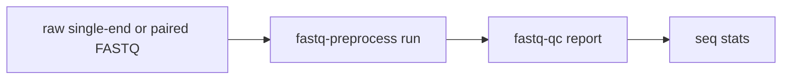
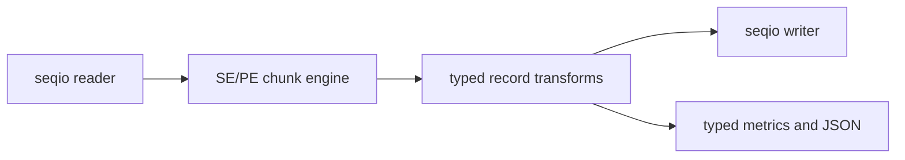

# Sequence and FASTQ product dossier

Status: source audit complete; first release slices selected; implementation
not yet merged.

The source pool contains 47 relevant historical crates after routing
corrections: 34 for `rsomics-seq`, 12 for preprocessing, and one for QC. The
reuse unit is an algorithm module plus its evidence, not the old CLI shell.

## Shared design

The three products share `rsomics-seqio` for strict FASTA/FASTQ I/O and use
`rsomics-common` and `rsomics-help` for a product/subcommand command tree.
`rsomics-kmer` serves sequence k-mer operations and preprocessing algorithms.

The first end-to-end gate is:

The same versioned inputs are compared against fastp, FastQC, and SeqKit.
Compatibility, wall-clock distribution, peak memory, compression mode, and
thread count are recorded together.

`rsomics-seqio` must provide:

- strict FASTA and FASTQ readers and writers;
- plain, gzip, and BGZF detection by content;
- path and stdin/stdout boundaries;
- borrowed streaming records plus owned batches for parallel stages;
- paired-read semantics;
- a private compression backend.

The historical `rsomics-fqgz` writer and `rsomics-igzip` backend are migration
assets. New products do not depend on `rsomics-igzip` directly.

## `rsomics-seq`

### Boundary

One coherent FASTA/FASTQ utility product. Format-generic commands operate on
both formats when their semantics permit it; sequence-, codon-, and
protein-specific commands remain explicit subcommands.

### First release slice

| Subcommand | Canonical historical assets | Initial compatibility oracle |
|---|---|---|
| `stats` | `fasta-stats`, `fastq-stats`, N50 edge fixtures | SeqKit |
| `grep` | `seq-grep`, selected utils fixtures | SeqKit |
| `convert` | `fastx-convert`, `fasta-fx2tab` | SeqKit and format goldens |
| `validate` | `fasta-validate`, `fastq-validate` tests | strict format behavior |

This slice deliberately exercises FASTA/FASTQ, compression, stdin/stdout,
multi-subcommand help, JSON, and error propagation before broader migration.

### Later operation groups

| Group | Target operations | Primary source assets |
|---|---|---|
| generic transforms | sample, shuffle, sort, split, head, rename, revcomp, wrap, case conversion, subseq, interleave | `fasta-utils`, `fastq-utils`, `fastq-sample`, `fasta-subseq` |
| motif and feature search | locate, amplicon, palindrome, ORF | `fasta-locate`, `fasta-amplicon`, `palindrome`, `fasta-orf` |
| translation and coding | translate, codon usage, CAI, Nc, GC3 | `fasta-translate`, `cusp`, `cai`, `chips`, `gc123` |
| composition and physical properties | GC windows/skew, molecular weight, melting temperature, protein properties | `gc-windows`, `gc-skew`, `molecular-weight`, `tm-nn`, `prot-param` |
| alignment and consensus | global/local alignment, consensus | `align-score`, internalized `align-core`, consensus fixtures |

### Asset dispositions

- Direct merge after namespace and I/O adaptation: `aa-code`, `cai`, `chips`,
  `cusp`, `fasta-amplicon`, `fasta-fx2tab`, `fasta-locate`, `fasta-orf`,
  `fasta-sliding`, `fasta-stats`, `fasta-subseq`, `fasta-translate`,
  `fastq-stats`, `gc-skew`, `gc-windows`, `gc123`, `molecular-weight`,
  `palindrome`, `prot-param`, `seq-grep`, and the `tm-nn` algorithm.
- Refactor before merge: `align-score`, `fasta-digest`, both utils suites,
  both validators, `fastq-sample`, and `fastx-convert`.
- Evidence only or superseded: `fasta-n50`, `fastq-downsample`,
  `motif-scan`, and `seq-stats`.
- Rewrite: consensus semantics and traceback compatibility require new
  validation rather than inheriting current claims.

`rsomics-seqstats` is not retained as a public foundation. Statistics specific
to this product remain internal until a second product requires the same typed
contract.

## `rsomics-fastq-preprocess`

### Boundary

Read preprocessing over a shared single-end/paired-end chunk engine. Individual
operations remain callable, while `run` composes transforms in one
decompression/traversal/compression pass.

### First release slice

- `run`
- `trim`
- `filter`

The initial source assets are `rsomics-fastq-trim`,
`rsomics-fastq-filter`, `rsomics-fastq-quality`, and
`rsomics-fastq-complexity`.

### Internal architecture

Trim, filter, complexity, UMI, and deduplication logic are pure transforms
where possible. Merge, pairing, correction, and reference-based
decontamination may own specialized stages but share the same record and I/O
contracts.

### Asset dispositions

- Direct merge after I/O extraction: `fastq-filter`, `fastq-merge`,
  `fastq-split`, `fastq-trim`, and `fastq-umi`.
- Refactor before merge: `bbduk`, `fastq-complexity`, `fastq-correct`,
  `fastq-dedup`, `fastq-pair`, and `fastq-quality`.
- Evidence only: the old `fastp` CLI, JSON, and fixtures. Its duplicate
  implementation is replaced by the stronger operation modules.

Correction and BBDuk-style filtering ship only after adversarial
compatibility and representative hot-path benchmarks. Existing small
subprocess benches are not release evidence.

## `rsomics-fastq-qc`

### Boundary

FastQC-style diagnostics and reports. Generic counts and length statistics
belong to `rsomics-seq stats`; preprocessing reports belong to
`rsomics-fastq-preprocess`.

The historical `rsomics-fastqc` implementation is a refactor seed, not a
finished compatibility claim. Its twelve analyzers are retained, but the
product requires:

- a typed analyzer pipeline without per-read trait-object dispatch;
- one or more fixtures that trigger PASS, WARN, and FAIL for every module;
- full module-data comparison, not summary status alone;
- documented long-read binning and duplication-curve behavior;
- complete text/HTML report compatibility rules;
- single-thread and multi-thread performance evidence.

The first slice is `report --format fastqc`, integrated with the new
`rsomics-seqio`.

## Origin and reuse

The historical Rust implementations are team-owned and may be merged directly.
That does not promote inherited README claims to verified facts. Target
products retain exact upstream names, versions, black-box commands, public
format specifications, papers where relevant, and third-party dependency
licenses.

In particular, FastQC “exact” claims, incomplete digest enzyme semantics, and
the old FASTQ validator's parser behavior must be re-established by tests
before documentation or release.
