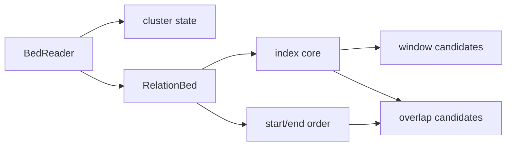

# rsomics-bed distance and neighborhood slice

Date: 2026-08-20

Status: implemented at performance source
`d7b1507b178053a087862255d84a244e4921f192` and prepared as release candidate
`02b85a1a348c271e485cca629dc4e71fa075388a`; exact-head four-platform CI and
both representative Linux gates pass. Registry publication is blocked by the
expired credential. This design covers the `rsomics-bed` 0.2 release slice
only. The complete family boundary is in `docs/10-products/bed.md`.

## Outcome

Add three complete, useful BED operations to the existing product:

- `cluster` assigns IDs to sorted overlapping or nearby records;
- `window` reports B records within a configurable neighborhood of A;
- `closest` reports the nearest eligible B record or records for each A.

The slice replaces three historical micro-crates with modules of the existing
binary. It does not publish an operation-sized crate, advertise a future flag,
or create a public foundation.

## Compatibility scope

BEDTools 2.31.1 is the byte-level oracle. BEDOPS 2.4.41
`closest-features` is a secondary semantic and performance reference for
nearest-neighbor behavior.

### `cluster`

The declared contract covers the complete documented BED input surface:

- distance zero by default, including book-ended records;
- `--distance <BP>` for a nonnegative maximum gap;
- `--strand any|same`, with `-s` as a compatibility alias;
- one-based cluster IDs, preserving input order in unstranded mode and using
  BEDTools' chromosome-local `+` then `-` output order in same-strand mode;
- checked chromosome grouping and nondecreasing start coordinates.

Same-strand mode requires valid BED6 records. Missing, malformed, or unsupported
strand values fail before partial named output is committed instead of being
silently discarded as they are by the upstream executable.

### `window`

The declared BED-only contract covers:

- `--window <BP>` with the upstream default of 1000;
- paired `--left <BP>` and `--right <BP>` asymmetric windows;
- `--strand-relative`, which swaps left and right on negative-strand A records;
- `--strand any|same|opposite`;
- `--report pairs|any|count|none` for the upstream default, `-u`, `-c`, and
  `-v` behaviors.

`--window` conflicts with either asymmetric side. `--left` and `--right` must
appear together. Strand-relative windows require valid BED6 A records; strand
filtering requires valid BED6 on both sides. Coordinate expansion uses checked
arithmetic and fails rather than clamping at the upper `u64` boundary. The
lower boundary is naturally bounded at zero, matching genomic coordinates.
Multiple B matches are emitted in stable B-file order. BEDTools 2.31.1 may
instead expose UCSC-bin traversal order when matches cross internal bin
boundaries; rsomics records that incidental ordering as an explicit divergence
rather than reproducing it.

### `closest`

The declared single-B BED contract covers:

- overlapping records before non-overlapping neighbors;
- explicit BEDTools zero-length virtual footprints;
- `--strand any|same|opposite`;
- `--different-name`, requiring BED4 on A and B;
- `--ignore-overlaps`;
- `--distance none|unsigned|reference|a|b`;
- `--tie all|first|last`;
- upstream placeholders when no eligible B record exists on the chromosome.

Signed modes use the BEDTools reference, A-strand, or B-strand orientation
rules. The A and B modes require the corresponding valid BED6 strand. This
slice intentionally does not expose multiple B databases, `k > 1`, or
upstream/downstream ignore and preference switches. They remain absent rather
than accepted and ignored.

Unsigned and distance-free ties retain B-file order. Signed modes order equal
absolute distances by signed direction and then B-file order; `first` and
`last` apply after that ordering, matching the pinned executable. Required B
names and strands are validated before A streams so an unused chromosome
cannot hide malformed selected fields.

## CLI and output

The three commands use the existing product-level `rsomics-help` parsing and
`rsomics-common` result/error envelope. Long typed values are canonical; only
unambiguous BEDTools short flags become migration aliases.

BEDTools multi-character single-dash spellings such as `-sw`, `-sm`, `-Sm`,
and `-io` are not reinterpreted as Clap short-option clusters. Their typed long
forms own the product contract.

`window` pair mode writes the original A fields followed by the original B
fields. Any and none modes write A once. Count mode appends one count column.
`closest` writes A followed by B and then an optional distance. `cluster`
appends one cluster-ID column. Optional input fields remain byte-identical.

All three commands accept one standard-input consumer. B must be a named path
for `window` and `closest`, which keeps A streamable. Named output is
transactional and cannot alias an input through spelling, normalization,
symlink, or hard link. JSON mode requires a named data output so result JSON
cannot mix with BED text on stdout.

Headers remain omitted in this slice, matching the product's published default
policy. No `--header` flag is advertised until header retention is represented
by the shared reader instead of reconstructed by each operation.

## Internal model

`BedRecord` remains the owned streaming record for A and cluster input.
`RelationBed` reads B once into a contiguous raw byte buffer and stores only
record ranges, physical line numbers, checked coordinates, and required
orderings. Checked optional-field access is shared over raw bytes. Operations
request an optional field only when their contract needs it; ordinary BED3
operations do not start validating unrelated display fields.

`overlap_index.rs` is separated into:

- an index core over checked coordinate records and per-chromosome query
  metadata;
- the existing coordinate-only wrapper used by `intersect`, preserving its
  current memory profile;
- a relation wrapper that retains raw B ranges, exposes file-ordered range
  queries for `window`, and adds start/end directional order for `closest`.

The core keeps one index implementation and one zero-length policy. Virtual
bounds are reconstructed from already validated original coordinates instead
of stored twice. The relation wrapper preserves B file IDs for duplicate
multiplicity and tie ordering. `window` submits an expanded query range and
receives file-ordered candidates. `closest` advances outward through the two
directional orders only until the best eligible distance has been exhausted.

`cluster` does not use an interval index. Unstranded execution is a
constant-space state machine over a sorted `BedReader`. Same-strand execution
buffers one chromosome at a time so it can reproduce BEDTools' `+` then `-`
output order while retaining streaming input and bounded memory.

No part of this model moves into `rsomics-intervals`. It contains BED output,
tie, zero-length, strand, and backend policy and therefore has only one product
consumer.

## Historical code use

`rsomics-bed-cluster` at `b63b75567ba729c016a4baabbbc3bb28bad0718e`
contributes its streaming sweep and basic distance goldens. Its parser, CLI,
closed-chromosome allocation, and narrated comments are discarded.

`rsomics-bed-closest` at `e85ed1339165d2552f86223190975175cbe4318a`
contributes the corrected book-end distance, zero-length cases, tie fixtures,
and no-chromosome placeholder evidence. Its permissive B parsing, string data
model, per-A full scan, direct file output, and old help shell are discarded.

`rsomics-bed-window` at `875459ee2f793505d8256d958bb634e36a4ab19a`
is a fixture and benchmark asset only. The target does not copy its duplicated
parser, eager string records, optional-or-zero numeric parsing, output shell,
or tests that silently skip the oracle.

## Failure behavior

- malformed BED, invalid optional fields used by the selected mode, coordinate
  overflow, sort violations, and I/O failures propagate to the top level;
- a missing same-chromosome B record is valid closest output, not an error;
- missing BED4/BED6 data required by a selected mode is an input error;
- incompatible flags are configuration errors before inputs are opened;
- unsupported upstream options are rejected by Clap because they are absent;
- no parser, index, or output error is converted into an empty successful
  result.

## Tests and evidence

Implementation is test-driven one operation at a time. Each operation receives:

- internal boundary tests for its typed state and arithmetic;
- CLI tests for help, incompatible flags, exit classes, stdout/JSON separation,
  stdin, output aliasing, and failure preservation;
- frozen BEDTools output for all supported modes;
- live pinned BEDTools 2.31.1 differentials in debug and release;
- seeded differentials varying chromosomes, order, duplicate coordinates,
  nesting, long intervals, no hits, zero length, optional columns, strands,
  and the index coordinate boundary.

The existing five operations run after every shared parser or index change.
Their representative benchmark is rerun before release because old performance
evidence cannot cover a changed internal core.

The release performance gate uses a multi-million-record sorted cluster stream
and both sparse and dense relation fixtures. Window and closest B sets are
large enough that a full per-A scan cannot pass. Ten paired measurements after
warmup record output equality, time distribution, CPU, peak RSS, exact binary
and oracle identities, fixture hashes, commands, and an explicit decision for
each operation.

The accepted source passes at 4.07-5.19x for cluster, 4.17x for window pairs,
1.23-1.36x for closest, and 13.98x for dense window count. The first benchmark
head failed default closest at 0.943x; it was rejected before compact raw B
storage and index-order reuse reduced time to 1.349 seconds and RSS from
577,304 to 316,696 KiB. Closest claims throughput, not memory superiority over
the sorted-stream upstream implementation.

## Source quality

Modules are named by operation and keep narrow typed interfaces. Comments are
limited to stable compatibility reasons and non-obvious invariants. Audit
history, implementation phases, and control-flow narration stay in this spec
and migration documents rather than source code.

The release gate is formatting, strict Clippy, debug and release tests, pinned
live oracles, package verification, exact-head native CI on Linux and macOS for
`x86_64` and `aarch64`, representative performance, and a fresh public API and
hot-path review. Version 0.2.0 is published only after all three declared
commands pass that gate.
